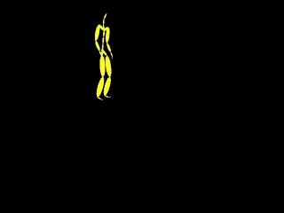
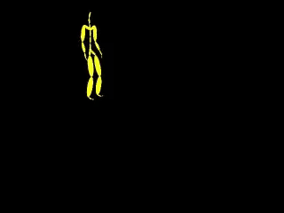

## GAIL-UR10
[Robot manipulation course project]
As a recent breakthrough, [**Generative Adversarial Imitation Learning**](https://arxiv.org/pdf/1606.03476.pdf) (GAIL) provides a new possibility for robots to generate human-like movement patterns from demonstrations. In general, GAIL compares state-action pairs from demonstrations against state-action pairs from the policy by a discriminate classifier (discriminator). The imitation policy is assigned rewards for fooling the discriminator. One of the key advantages of GAIL over previously RLfD techniques, i.e., behavior cloning and IRL, is that the similarity between imitation and demonstration is defined implicitly. Studies have demonstrated that the GAIL produces reusable motions for humanoid robots from only a small number of noisy human motion capture demonstrations. 

## TODO list
### Mocap Data processing
* Source mocap data [Subject #62(construction work, random motions)](http://mocap.cs.cmu.edu/search.php?subjectnumber=62)
* Two demos

*62_03*

 

*62_07*

 

### UR10 robot interface
* DOF control interface

### GAIL codes
* [To install dependencies](https://github.com/mingfeisun/GAIL-janathan)
* To run code

## Building & Running
### Dependencies
* [Universal Robot](https://github.com/mingfeisun/universal_robot)
* [Gazebo 8.0](https://github.com/mingfeisun/gazebo)
* [Gazebo ros pkg](https://github.com/mingfeisun/gazebo_ros_pkgs)

### Building
``` bash
# compiling ros pkgs
catkin_make
```

### Running 
TODO

## Misc
TODO
